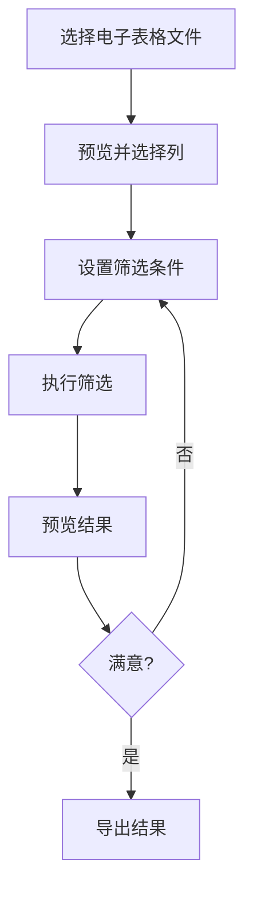
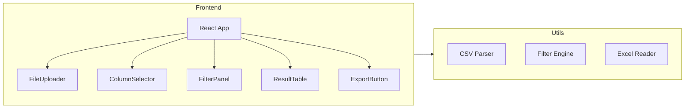
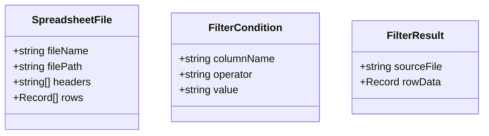

## 1. Product Overview

电子表格筛选工具是一个桌面端Web应用，用于批量处理多个电子表格文件。用户可以选择文件夹下的多个CSV/XLSX文件，通过设置筛选条件（单列或多列）过滤数据，并将筛选结果合并到一个统一的表格中，同时保留原始表格的列名信息。

在线链接：https://sumo166.github.io/Product-Overview/

## 2. Core Features

### 2.1 User Roles

| Role | Registration Method | Core Permissions                 |
| ---- | ------------------- | -------------------------------- |
| User | None (直接使用)     | 上传文件、设置筛选条件、导出结果 |

### 2.2 Feature Module

1. **文件选择模块**: 选择文件夹或多个电子表格文件
2. **列选择模块**: 预览并选择要筛选的列
3. **筛选条件模块**: 设置单列或多列的筛选条件
4. **结果预览模块**: 实时预览筛选结果
5. **导出模块**: 将结果导出为新的电子表格

### 2.3 Page Details

| Page Name | Module Name | Feature description                        |
| --------- | ----------- | ------------------------------------------ |
| 主页面    | 文件选择区  | 支持选择多个CSV/XLSX文件，显示已选文件列表 |
| 主页面    | 列选择区    | 预览所有表格的列名，支持多选列             |
| 主页面    | 筛选条件区  | 设置筛选规则（等于、包含、大于、小于等）   |
| 主页面    | 结果预览区  | 显示筛选后的数据表格，包含原始表格来源列   |
| 主页面    | 导出按钮    | 将结果导出为CSV文件                        |

## 3. Core Process



## 4. User Interface Design

### 4.1 Design Style

- **主色调**: 蓝色系 (#3B82F6)，专业、清晰
- **按钮样式**: 圆角矩形，hover效果增强交互感
- **字体**: 微软雅黑/Inter，清晰易读
- **布局**: 卡片式布局，分区明确
- **图标**: 使用Lucide图标库

### 4.2 Page Design Overview

| Page Name | Module Name | UI Elements                                               |
| --------- | ----------- | --------------------------------------------------------- |
| 主页面    | 文件选择区  | 文件选择按钮、已选文件列表、删除按钮                      |
| 主页面    | 列选择区    | 列名复选框列表、全选/取消全选按钮                         |
| 主页面    | 筛选条件区  | 条件添加/删除按钮、列选择下拉框、条件类型选择、条件值输入 |
| 主页面    | 结果预览区  | 分页表格、数据统计、原始文件名列                          |
| 主页面    | 导出区      | 导出按钮、格式选择                                        |

### 4.3 Responsiveness

- 桌面优先设计
- 响应式布局适配不同屏幕尺寸
- 移动端触控优化

### 4.4 交互设计

- 文件拖拽上传支持
- 实时筛选预览
- 条件组合（AND/OR）支持


## 1. Architecture Design



## 2. Technology Description

- Frontend: React@18 + TypeScript + TailwindCSS@3 + Vite
- Initialization Tool: vite-init
- Backend: None (纯前端应用)
- 第三方库: 
  - papaparse: CSV文件解析
  - xlsx: Excel文件解析
  - lucide-react: 图标库

## 3. Route Definitions

| Route | Purpose                  |
| ----- | ------------------------ |
| /     | 主页面，包含所有功能模块 |

## 4. API Definitions

无后端API，纯前端应用

## 5. Server Architecture Diagram

纯前端应用，无后端服务器

## 6. Data Model

### 6.1 Data Model Definition



### 6.2 Data Types

```typescript
interface SpreadsheetFile {
  fileName: string;
  filePath: string;
  headers: string[];
  rows: Record<string, any>[];
}

interface FilterCondition {
  id: string;
  columnName: string;
  operator: 'equals' | 'contains' | 'notContains' | 'greaterThan' | 'lessThan' | 'startsWith' | 'endsWith';
  value: string;
  logic: 'AND' | 'OR';
}

interface FilterResult {
  sourceFile: string;
  rowData: Record<string, any>;
}
```

## 7. Project Structure

```
src/
├── components/
│   ├── FileUploader.tsx      # 文件上传组件
│   ├── ColumnSelector.tsx    # 列选择组件
│   ├── FilterPanel.tsx       # 筛选条件面板
│   ├── ResultTable.tsx       # 结果表格组件
│   └── Header.tsx            # 头部组件
├── utils/
│   ├── csvParser.ts          # CSV解析工具
│   ├── excelParser.ts        # Excel解析工具
│   └── filterEngine.ts       # 筛选引擎
├── hooks/
│   └── useSpreadsheetFilter.ts # 主业务逻辑Hook
├── types/
│   └── index.ts              # 类型定义
├── App.tsx                   # 主应用组件
├── main.tsx                  # 入口文件
└── index.css                 # 全局样式
```

## 8. 核心功能实现

### 8.1 文件解析

- CSV文件: 使用papaparse库解析
- Excel文件: 使用xlsx库解析

### 8.2 筛选引擎

支持的筛选操作符:

- equals: 等于
- contains: 包含
- notContains: 不包含
- greaterThan: 大于
- lessThan: 小于
- startsWith: 开头是
- endsWith: 结尾是

### 8.3 结果合并

- 将多个表格的筛选结果合并到一个表格
- 添加"来源文件"列标识数据来源
- 保留原始表格的列名信息
